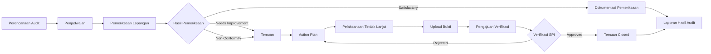

# Sistem Audit Internal (SPI)

<p align="center">
  <strong>Sistem Pengawasan & Audit Internal</strong><br>
  <span>PT Pindad Enjiniring Indonesia</span>
</p>

<p align="center">
  Aplikasi web terintegrasi untuk mendukung proses pengawasan internal,<br>
  mulai dari perencanaan audit hingga penerbitan Laporan Hasil Audit (LHA).
</p>

<p align="center">

</p>

<p align="center">
  
  
  
  
  
  
</p>

---

## Overview

**Sistem Audit Internal (SPI)** merupakan aplikasi web end-to-end yang dirancang untuk membantu proses pengawasan dan audit internal divisi di **PT Pindad Enjiniring Indonesia**.

Sistem mencatat seluruh proses audit secara terstruktur, mulai dari **perencanaan audit, pemeriksaan lapangan, pencatatan temuan, penyusunan tindak lanjut, verifikasi, hingga pelaporan dalam bentuk Laporan Hasil Audit (LHA).**

> **SPI memeriksa secara langsung, sistem mendokumentasikan prosesnya.**

Sistem juga menyediakan dashboard dan analisis untuk membantu SPI melihat perkembangan audit, distribusi risiko, status temuan, serta perbandingan temuan antar tahun dan divisi.

---

## Fitur Utama

### Dashboard

Dashboard berfungsi sebagai **lembar kontrol utama** untuk memantau kondisi audit dan temuan secara keseluruhan.

Fitur utama:

* KPI audit dan temuan
* Kalender audit
* Grafik distribusi status temuan
* Klasifikasi tingkat risiko
* Hasil pemeriksaan
* Ringkasan tindak lanjut
* Monitoring perkembangan audit

---

### Audit

Modul untuk mengelola siklus audit dari awal hingga selesai.

Mendukung:

* Pembuatan rencana audit
* Penjadwalan audit
* Penugasan auditor
* Memulai pemeriksaan
* Penyelesaian audit
* Reaktivasi audit
* Monitoring status audit

**Siklus audit:**

```text
Draft
  ↓
Terjadwal
  ↓
Pemeriksaan
  ↓
Selesai
```

---

### Pemeriksaan

Modul untuk mendokumentasikan hasil pemeriksaan langsung di divisi.

> Sistem tidak menggunakan formulir checklist pemeriksaan sebagai proses utama. Auditor melakukan pemeriksaan secara langsung dan menggunakan sistem untuk mendokumentasikan hasil serta bukti pemeriksaan.

Hasil pemeriksaan:

| Status              | Keterangan                       |
| ------------------- | -------------------------------- |
| `Satisfactory`      | Kondisi memenuhi ketentuan       |
| `Needs Improvement` | Diperlukan peningkatan/perbaikan |
| `Non-Conformity`    | Ditemukan ketidaksesuaian        |

Pemeriksaan juga mendukung:

* Catatan hasil pemeriksaan
* Bukti dokumentasi
* Lampiran file
* Relasi dengan audit
* Relasi dengan temuan

---

### Temuan

Modul untuk mencatat dan mengelola temuan yang diperoleh selama pemeriksaan.

Mendukung:

* Pencatatan temuan
* Klasifikasi risiko
* Status temuan
* Rencana tindak lanjut
* Pengajuan verifikasi
* Verifikasi SPI
* Penolakan tindak lanjut
* Pembukaan kembali temuan

**Status temuan:**

```text
Open
  ↓
In Progress
  ↓
Waiting Verification
  ↓
Closed
```

Apabila hasil verifikasi tidak memenuhi ketentuan:

```text
Waiting Verification
        ↓
     Rejected
        ↓
   In Progress
```

---

### Tindak Lanjut

Modul untuk memastikan setiap temuan memiliki tindakan perbaikan yang jelas dan dapat diverifikasi.

Fitur:

* Penyusunan action plan
* Target penyelesaian
* Dokumentasi tindakan
* Upload bukti perbaikan
* Pengajuan verifikasi
* Verifikasi oleh SPI
* Persetujuan atau penolakan

---

### Laporan

Modul pelaporan menyediakan informasi hasil audit dalam bentuk terstruktur.

Mencakup:

* Laporan Hasil Audit (LHA)
* Ringkasan audit
* Ringkasan temuan
* Analisis risiko
* Status tindak lanjut
* Detail pemeriksaan
* Rekap hasil audit
* Export laporan PDF

---

### Analisis Perbandingan

Fitur analitik untuk membandingkan perkembangan temuan berdasarkan tahun dan divisi.

Pengguna dapat membandingkan:

* Total temuan
* Status temuan
* Tingkat risiko
* Pertumbuhan temuan
* Distribusi temuan
* Performa antar divisi

Contoh perbandingan:

```text
                 ANALISIS TEMUAN

        2025                  2026
         │                     │
         ├── Total             ├── Total
         ├── Open              ├── Open
         ├── In Progress       ├── In Progress
         ├── Closed            ├── Closed
         ├── High Risk         ├── High Risk
         └── Medium Risk       └── Medium Risk
                    │
                    ▼
             Perbandingan
                    │
                    ▼
          Pertumbuhan Temuan
```

Analisis dapat difilter berdasarkan **divisi** untuk mendapatkan informasi yang lebih spesifik.

---

### Master Data

Super Admin dapat mengelola data referensi sistem:

* Divisi
* Jenis audit
* Kategori temuan
* Kategori risiko
* Hari libur
* Pengguna
* Hak akses pengguna

---

### Notifikasi & Audit Log

Sistem menyediakan mekanisme notifikasi berdasarkan aktivitas dan kebutuhan masing-masing role.

Selain itu tersedia **Audit Log** untuk mencatat aktivitas penting di dalam aplikasi.

Contoh aktivitas:

```text
User membuat audit
      ↓
Audit dijadwalkan
      ↓
Pemeriksaan dibuat
      ↓
Temuan dicatat
      ↓
Tindak lanjut diajukan
      ↓
Verifikasi dilakukan
      ↓
Temuan ditutup
```

---

# Role & Hak Akses

| Role              | Cakupan & Tanggung Jawab                                                                                          |
| ----------------- | ----------------------------------------------------------------------------------------------------------------- |
| **Super Admin**   | Akses penuh terhadap sistem, master data, pengguna, dan konfigurasi aplikasi.                                     |
| **SPI / Auditor** | Mengelola audit, melakukan pemeriksaan, mencatat temuan, melakukan verifikasi, dan menerbitkan LHA.               |
| **Kepala Divisi** | Mengelola tindak lanjut temuan pada divisinya serta melihat laporan dan analisis yang berkaitan dengan divisinya. |
| **Staff**         | Mengakses informasi dan fungsi yang diberikan sesuai kebijakan sistem.                                            |

### Scope Akses

```text
                    SISTEM SPI
                        │
          ┌─────────────┴─────────────┐
          │                           │
     Administrator                  Operasional
          │                           │
     Super Admin              ┌───────┴───────┐
                              │               │
                           SPI/Auditor    Divisi
                                              │
                                      ┌───────┴───────┐
                                      │               │
                                Kepala Divisi      Staff
```

Detail hak akses dan batasan setiap role dijelaskan pada:

* [`ALUR.md`](ALUR.md)
* [`FUNGSI.md`](FUNGSI.md)
* [`SISTEM.md`](SISTEM.md)

---

# Alur Utama Sistem

Secara keseluruhan proses SPI mengikuti siklus berikut:



---

# Siklus Temuan

```text
┌──────────────┐
│ Pemeriksaan  │
└──────┬───────┘
       │
       ▼
┌──────────────┐
│    Temuan    │
│     OPEN     │
└──────┬───────┘
       │
       ▼
┌──────────────────┐
│   IN PROGRESS    │
└────────┬─────────┘
         │
         ▼
┌────────────────────────┐
│ WAITING VERIFICATION   │
└───────────┬────────────┘
            │
       ┌────┴─────┐
       │          │
       ▼          ▼
  APPROVED     REJECTED
       │          │
       ▼          │
   CLOSED ◄───────┘
```

---

# Arsitektur Sistem

SPI menggunakan pendekatan **MVC (Model-View-Controller)** dengan Laravel sebagai backend sekaligus application layer.

```text
┌───────────────────────────────────────────┐
│                  USER                     │
│       Super Admin / SPI / Divisi          │
└─────────────────────┬─────────────────────┘
                      │
                      ▼
┌───────────────────────────────────────────┐
│              BLADE + BOOTSTRAP            │
│          User Interface / Frontend        │
└─────────────────────┬─────────────────────┘
                      │
                      ▼
┌───────────────────────────────────────────┐
│              LARAVEL 13                    │
│                                           │
│  Routes → Middleware → Controller → Model │
│                         │                 │
│                         ▼                 │
│                    Business Logic         │
└─────────────────────┬─────────────────────┘
                      │
                      ▼
┌───────────────────────────────────────────┐
│                  MYSQL                    │
│              Relational DB                │
└───────────────────────────────────────────┘
```

---

# Tech Stack

### Backend

| Teknologi         | Penggunaan            |
| ----------------- | --------------------- |
| **Laravel 13**    | Framework backend     |
| **PHP 8.3+**      | Runtime               |
| **Eloquent ORM**  | Database interaction  |
| **Laravel Blade** | Server-side rendering |

### Frontend

| Teknologi                 | Penggunaan         |
| ------------------------- | ------------------ |
| **Blade**                 | Template engine    |
| **Bootstrap 5**           | UI framework       |
| **Bootstrap Icons**       | Icon system        |
| **Tailwind CSS via Vite** | Utility styling    |
| **Chart.js**              | Data visualization |

### Database & Reporting

| Teknologi  | Penggunaan            |
| ---------- | --------------------- |
| **MySQL**  | Database              |
| **DOMPDF** | PDF report generation |

---

# 🎨 Design System

Sistem menggunakan konsep visual **Blueprint / Engineering** yang menyesuaikan karakter aplikasi pengawasan dan lingkungan industri.

### Color Palette

| Nama          | Hex       | Penggunaan     |
| ------------- | --------- | -------------- |
| Navy          | `#18324D` | Primary dark   |
| Blue          | `#2D6AC7` | Primary action |
| Slate         | `#405A73` | Secondary      |
| Light Slate   | `#9AA8B5` | Supporting UI  |
| Pindad Yellow | `#FFC72C` | Accent         |

Karakter visual:

* Clean
* Professional
* Engineering-oriented
* Soft contrast
* Rounded components
* Minimal visual noise
* Consistent status & risk badges

Sistem membagi area visual menjadi:

```text
LGX
└── Authentication
    ├── Login
    └── Authentication Pages

SDX
└── Main Application
    ├── Dashboard
    ├── Audit
    ├── Pemeriksaan
    ├── Temuan
    ├── Tindak Lanjut
    ├── Laporan
    ├── Analisis
    └── Master Data
```

Detail design system tersedia pada [`DESIGN.md`](DESIGN.md).

---

# Struktur Dokumentasi

Dokumentasi proyek dipisahkan menjadi beberapa file agar informasi sistem lebih mudah dipelihara.

| File                       | Deskripsi                                        |
| -------------------------- | ------------------------------------------------ |
| [`MASTERP.md`](MASTERP.md) | Arahan utama project, scope, dan role            |
| [`ALUR.md`](ALUR.md)       | Alur penggunaan aplikasi berdasarkan role        |
| [`FUNGSI.md`](FUNGSI.md)   | Fungsi dan tanggung jawab setiap modul           |
| [`SISTEM.md`](SISTEM.md)   | Arsitektur dan aturan sistem                     |
| [`DESIGN.md`](DESIGN.md)   | Design system, warna, komponen, dan UI guideline |

---

# Instalasi

## 1. Clone Repository

```bash
git clone <repository-url>
cd <project-folder>
```

## 2. Install Dependency

Install dependency Laravel:

```bash
composer install
```

Install dependency frontend:

```bash
npm install
```

---

## 3. Konfigurasi Environment

Salin file `.env.example` menjadi `.env`.

```bash
cp .env.example .env
```

Pada Windows apabila perintah `cp` tidak tersedia, file dapat disalin secara manual:

```text
.env.example → .env
```

Kemudian generate application key:

```bash
php artisan key:generate
```

---

## 4. Konfigurasi Database

Buka file `.env` dan sesuaikan konfigurasi MySQL:

```env
DB_CONNECTION=mysql
DB_HOST=127.0.0.1
DB_PORT=3306
DB_DATABASE=spi
DB_USERNAME=root
DB_PASSWORD=
```

Pastikan database `spi` sudah dibuat sebelum menjalankan migration.

---

## 5. Migration & Seed

Jalankan migration sekaligus seed master data:

```bash
php artisan migrate --seed
```

Perintah tersebut akan membuat struktur database sekaligus data awal yang diperlukan aplikasi.

---

## 6. Seed Data Demo

Untuk mengisi data demo lengkap:

```bash
php artisan db:seed --class=FullGrowthDataSeeder
```

Seeder tersebut membuat rantai audit lengkap yang terdiri dari:

```text
Audit
  ↓
Pemeriksaan
  ↓
Temuan
  ↓
Tindak Lanjut
  ↓
Verifikasi
  ↓
LHA
```

Data tersebar pada beberapa divisi dan tahun **2021–2026**.

> `FullGrowthDataSeeder` tidak mengubah master data dan dapat dijalankan kembali untuk kebutuhan pengembangan/demo.

---

## 7. Jalankan Aplikasi

Jalankan Laravel:

```bash
php artisan serve
```

Kemudian jalankan Vite:

```bash
npm run dev
```

Untuk production build:

```bash
npm run build
```

Secara default aplikasi Laravel dapat diakses melalui:

```text
http://127.0.0.1:8000
```

---

# Data Demo

Project menyediakan `FullGrowthDataSeeder` untuk mempermudah proses development dan demonstrasi.

Seeder menghasilkan **20 rantai audit lengkap** dengan data:

* Audit
* Pemeriksaan
* Temuan
* Risiko
* Tindak lanjut
* Verifikasi
* LHA

Data dibuat dengan distribusi tahun **2021–2026** dan beberapa divisi sehingga fitur:

* Dashboard
* Grafik
* Analisis pertumbuhan
* Perbandingan tahun
* Perbandingan divisi
* Status temuan
* Analisis risiko

dapat langsung digunakan tanpa harus memasukkan seluruh data secara manual.

---

# Analisis Data

Dashboard dan modul analisis dirancang untuk memberikan gambaran kondisi pengawasan secara cepat.

Informasi yang dapat dianalisis meliputi:

```text
                    ANALYTICS
                        │
        ┌───────────────┼───────────────┐
        │               │               │
      Audit          Temuan           Risiko
        │               │               │
     Status          Status          Level
     Tahun           Tahun           Tahun
     Divisi          Divisi          Divisi
        │               │               │
        └───────────────┼───────────────┘
                        │
                        ▼
                 Insight Pengawasan
```

---

# 🔐 Security & Access Control

Akses aplikasi dibatasi berdasarkan role dan scope pengguna.

Prinsip utama:

* User hanya dapat mengakses fitur sesuai role.
* Kepala Divisi hanya dapat mengelola data yang berkaitan dengan divisinya.
* Proses verifikasi tindak lanjut dilakukan oleh SPI.
* Master data berada pada kewenangan Super Admin.
* Aktivitas penting dicatat melalui Audit Log.
* Akses terhadap laporan dan analisis mengikuti scope pengguna.

---

# 📌 Prinsip Sistem

SPI dibangun berdasarkan beberapa prinsip utama:

### 1. Direct Inspection

Pemeriksaan dilakukan secara langsung oleh auditor di divisi.

### 2. Structured Documentation

Sistem berfungsi sebagai media dokumentasi seluruh proses audit.

### 3. Traceability

Setiap temuan dapat ditelusuri dari pemeriksaan hingga proses verifikasi.

### 4. Accountability

Setiap proses memiliki aktor dan status yang jelas.

### 5. Data-driven Monitoring

Dashboard dan analisis digunakan untuk membantu pemantauan kondisi audit dan temuan.

---

# Roadmap

Pengembangan sistem dapat diarahkan ke beberapa tahap berikut:

* [x] Authentication
* [x] Role & Access Control
* [x] Dashboard
* [x] Audit Management
* [x] Pemeriksaan
* [x] Temuan
* [x] Tindak Lanjut
* [x] Verifikasi
* [x] Laporan / LHA
* [x] Analisis Perbandingan
* [x] Master Data
* [x] Notifikasi
* [x] Audit Log
* [x] Demo Data Seeder

Pengembangan lanjutan dapat mencakup:

* [ ] Penyempurnaan export laporan
* [ ] Advanced analytics
* [ ] Optimasi performa
* [ ] Notification center
* [ ] Automated reporting
* [ ] Deployment production

---

# Screenshots

> Tambahkan screenshot aplikasi pada bagian ini untuk memberikan gambaran visual sistem.

Contoh:

```text
docs/
└── screenshots/
    ├── dashboard.png
    ├── audit.png
    ├── pemeriksaan.png
    ├── temuan.png
    ├── tindak-lanjut.png
    ├── laporan.png
    └── analisis.png
```

Kemudian tampilkan:

```markdown

```

Disarankan minimal menampilkan:

1. Login
2. Dashboard
3. Audit
4. Pemeriksaan
5. Temuan
6. Tindak Lanjut
7. Laporan
8. Analisis Perbandingan

---

# Project Context

**Sistem Audit Internal (SPI)** dikembangkan sebagai aplikasi pendukung proses pengawasan internal **PT Pindad Enjiniring Indonesia**.

Sistem berfokus pada dokumentasi, monitoring, pengendalian tindak lanjut, serta penyajian informasi audit secara terstruktur.

> **Inspect. Document. Follow Up. Verify. Report.**

---

# License

Dikembangkan untuk kebutuhan internal:

**PT Pindad Enjiniring Indonesia**

Penggunaan, distribusi, dan modifikasi sistem mengikuti kebijakan internal perusahaan.

---

<p align="center">
  <strong>Sistem Audit Internal (SPI)</strong><br>
  <sub>Internal Audit & Oversight Management System</sub>
</p>
